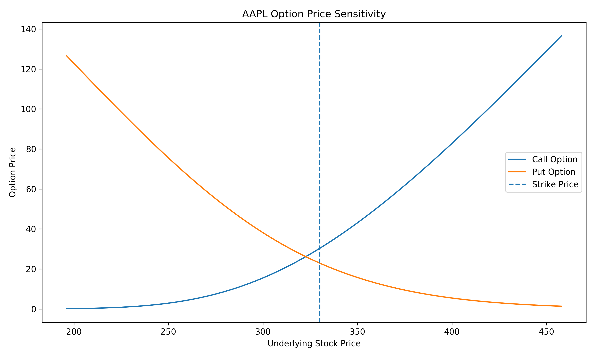
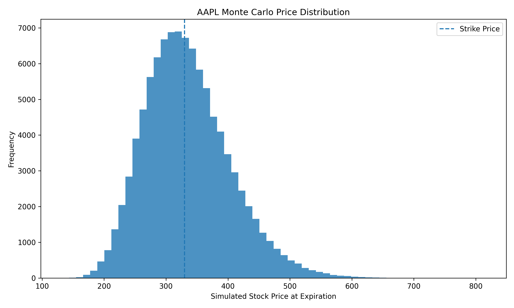
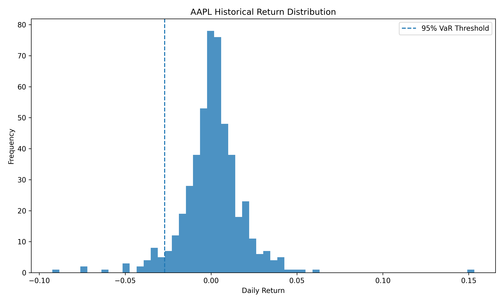

# Options Pricing & Risk Analytics

A quantitative finance project implementing **Black-Scholes option pricing, Monte Carlo simulation, option Greeks, historical volatility estimation, sensitivity analysis, and Value at Risk (VaR)** using Python and historical AAPL market data.

---

## Project Overview

The objective of this project is to build a quantitative framework for pricing European options and analyzing market risk.

The project combines:

- Historical stock-market data
- Black-Scholes analytical option pricing
- Monte Carlo simulation
- Option Greeks
- Historical volatility estimation
- Value at Risk
- Option-price sensitivity analysis
- Model comparison and visualization

Historical AAPL price data is downloaded using **Yahoo Finance through the `yfinance` library**.

---

## Objectives

- Download and process historical stock-price data
- Estimate annualized historical volatility
- Price European call and put options using the Black-Scholes model
- Price options using Monte Carlo simulation
- Compare analytical and simulation-based option prices
- Calculate Delta, Gamma, Vega, Theta, and Rho
- Estimate historical Value at Risk at 95% and 99% confidence levels
- Analyze option-price sensitivity to changes in the underlying stock price
- Visualize simulated future stock-price distributions and historical returns

---

## Tools & Technologies

- Python
- NumPy
- Pandas
- Matplotlib
- SciPy
- yfinance

---

## Market Data

The project uses approximately **2 years of historical AAPL market data** downloaded through Yahoo Finance.

Historical daily returns are calculated from adjusted closing prices and used to estimate annualized volatility and historical Value at Risk.

### Sample Run Parameters

| Parameter | Value |
|---|---:|
| Ticker | AAPL |
| Spot Price | $327.05 |
| Strike Price | $330 |
| Time to Maturity | 0.5 years |
| Risk-Free Rate | 4.5% |
| Annualized Historical Volatility | 28.77% |
| Monte Carlo Simulations | 100,000 |
| VaR Portfolio Value | $100,000 |

> Market prices and historical volatility can change when the program is rerun because the dataset is downloaded dynamically.

---

## Historical Volatility

Daily stock returns are calculated as:

```text
Daily Return = (Price_t / Price_(t-1)) - 1
```

Annualized historical volatility is estimated as:

```text
Annualized Volatility = Standard Deviation of Daily Returns × √252
```

For the sample run:

```text
Annualized Historical Volatility = 28.77%
```

---

## Black-Scholes Option Pricing

European call and put options are priced using the Black-Scholes model.

The model uses:

- Current stock price
- Strike price
- Time to maturity
- Risk-free interest rate
- Historical volatility

### Black-Scholes Results

| Option | Price |
|---|---:|
| Call | $28.58 |
| Put | $24.18 |

---

## Monte Carlo Simulation

A **Geometric Brownian Motion** model is used to simulate future AAPL stock prices.

The project generates:

```text
100,000 simulated terminal stock prices
```

under the risk-neutral pricing framework.

Call and put option payoffs are calculated at expiration and discounted back to present value.

### Monte Carlo Results

| Option | Price |
|---|---:|
| Call | $28.65 |
| Put | $24.18 |

---

## Black-Scholes vs Monte Carlo

The two pricing approaches produced very similar results.

| Model | Call Price | Put Price |
|---|---:|---:|
| Black-Scholes | $28.5771 | $24.1850 |
| Monte Carlo | $28.6467 | $24.1791 |

### Pricing Difference

```text
Call Price Difference = $0.0696
Put Price Difference  = -$0.0059
```

The small difference between the analytical Black-Scholes price and the Monte Carlo estimate demonstrates convergence of the simulation-based pricing approach.

---

## Option Greeks

The project calculates the primary option risk sensitivities.

### Delta

Measures sensitivity of option price to changes in the underlying stock price.

```text
Call Delta = 0.566780
Put Delta  = -0.433220
```

### Gamma

Measures the rate of change of Delta with respect to the underlying stock price.

```text
Gamma = 0.005911
```

### Vega

Measures sensitivity of option price to changes in volatility.

```text
Vega = 0.909635
```

### Theta

Measures sensitivity of option value to the passage of time.

```text
Call Theta = -0.091040
Put Theta  = -0.051260
```

### Rho

Measures sensitivity of option price to changes in the risk-free interest rate.

```text
Call Rho = 0.783942
Put Rho  = -0.829347
```

---

## Value at Risk

Historical Value at Risk is estimated using the empirical distribution of AAPL daily returns.

The analysis assumes a hypothetical portfolio value of:

```text
$100,000
```

### VaR Results

| Confidence Level | Historical VaR |
|---|---:|
| 95% | $2,701.72 |
| 99% | $4,980.49 |

Under the historical-return methodology, the estimated one-day loss threshold is approximately **$2.70K at 95% confidence** and **$4.98K at 99% confidence** for the hypothetical $100,000 position.

---

## Option Price Sensitivity

The project evaluates how Black-Scholes call and put prices change as the underlying stock price varies.



The visualization demonstrates that:

- Call-option value generally increases as the stock price increases
- Put-option value generally decreases as the stock price increases
- The strike price of **$330** provides a reference point for option moneyness

---

## Monte Carlo Price Distribution

The distribution of simulated AAPL prices at expiration is visualized below.



The simulation captures a wide range of possible terminal stock prices generated under the assumed volatility, interest rate, and time horizon.

---

## Historical Return Distribution & VaR

Historical AAPL daily returns are visualized together with the 95% VaR threshold.



The left-tail threshold represents the historical return percentile used to estimate potential downside risk.

---

## Key Results

- Estimated **28.77% annualized historical volatility**
- Implemented analytical **Black-Scholes call and put pricing**
- Simulated **100,000 future stock-price outcomes**
- Obtained Black-Scholes call price of **$28.58**
- Obtained Monte Carlo call price of **$28.65**
- Achieved only approximately **$0.07 difference** between the two call-price estimates
- Calculated **Delta, Gamma, Vega, Theta, and Rho**
- Estimated **95% historical VaR of $2,701.72**
- Estimated **99% historical VaR of $4,980.49**
- Generated option-price sensitivity and risk visualizations

---

## Project Structure

```text
Options-Pricing-Risk-Analytics/
│
├── README.md
├── options_risk_analysis.py
├── requirements.txt
│
└── outputs/
    ├── model_comparison.csv
    ├── option_greeks.csv
    ├── risk_metrics.csv
    ├── option_price_sensitivity.png
    ├── monte_carlo_distribution.png
    └── return_distribution_var.png
```

---

## Output Files

### `model_comparison.csv`

Contains:

- Black-Scholes call price
- Black-Scholes put price
- Monte Carlo call price
- Monte Carlo put price
- Pricing differences between the two approaches

### `option_greeks.csv`

Contains calculated option sensitivities:

- Call Delta
- Put Delta
- Gamma
- Vega
- Call Theta
- Put Theta
- Call Rho
- Put Rho

### `risk_metrics.csv`

Contains:

- Portfolio value
- 95% Historical VaR
- 99% Historical VaR
- Annualized historical volatility

### `option_price_sensitivity.png`

Visualizes call and put option prices across different underlying stock prices.

### `monte_carlo_distribution.png`

Visualizes the distribution of simulated AAPL stock prices at expiration.

### `return_distribution_var.png`

Visualizes historical daily returns and the 95% VaR threshold.

---

## How to Run

Clone the repository:

```bash
git clone https://github.com/karthikeyavarmaP/Options-Pricing-Risk-Analytics.git
```

Navigate to the repository:

```bash
cd Options-Pricing-Risk-Analytics
```

Install dependencies:

```bash
pip install -r requirements.txt
```

Run the analysis:

```bash
python options_risk_analysis.py
```

The program automatically downloads historical market data and creates the output files inside the `outputs/` directory.

---

## Requirements

```text
numpy
pandas
matplotlib
scipy
yfinance
```

---

## Quantitative Insights

### Analytical and Simulation Pricing Are Closely Aligned

The Black-Scholes call price of **$28.58** and Monte Carlo estimate of **$28.65** differed by only approximately **$0.07**.

This demonstrates that a sufficiently large Monte Carlo simulation can produce an estimate close to the analytical Black-Scholes benchmark under consistent assumptions.

### At-the-Money Options Exhibit Meaningful Price Sensitivity

With AAPL trading near **$327.05** and a strike price of **$330**, the option is approximately at-the-money.

The call Delta of approximately **0.567** indicates substantial sensitivity of the call price to changes in the underlying stock price.

### Volatility Is an Important Driver of Option Value

The estimated annualized historical volatility was approximately **28.77%**.

The calculated Vega quantifies the sensitivity of the option value to changes in volatility.

### Tail Risk Increases at Higher Confidence Levels

Historical VaR increased from approximately **$2.70K at 95% confidence** to **$4.98K at 99% confidence**, highlighting the larger potential losses associated with more extreme return scenarios.

---

## Limitations

- Black-Scholes assumes constant volatility and interest rates
- The model assumes frictionless markets
- European-style exercise is assumed
- Historical volatility may not represent future volatility
- Historical VaR depends on the observed return distribution
- VaR does not measure losses beyond the selected confidence threshold
- Monte Carlo results contain simulation error
- Transaction costs, dividends, liquidity, and market-impact effects are not explicitly modeled
- Results vary as new market data becomes available

---

## Future Improvements

- Implement implied-volatility estimation
- Add volatility surfaces and volatility smiles
- Compare historical and implied volatility
- Implement Expected Shortfall / Conditional VaR
- Add parametric and Monte Carlo VaR
- Develop portfolio-level risk analytics
- Add multiple stocks and options
- Implement binomial-tree option pricing
- Analyze option strategies such as spreads and straddles
- Perform scenario and stress testing
- Add interactive Streamlit dashboards
- Incorporate real option-chain data

---

## Conclusion

This project demonstrates the integration of **option pricing, stochastic simulation, sensitivity analysis, and market-risk measurement** within a single Python-based quantitative framework.

Black-Scholes and Monte Carlo methods produced closely aligned option valuations, while option Greeks quantified sensitivity to key market variables.

Historical Value at Risk extended the analysis beyond pricing to downside-risk measurement.

The project demonstrates practical applications of **probability, statistics, numerical simulation, financial modeling, and Python programming** in quantitative finance.

---

## Disclaimer

This project is created for **educational and portfolio demonstration purposes only**.

Market data is obtained from publicly accessible financial-data sources, and all option-pricing and risk estimates depend on model assumptions and historical observations.

The results should **not be interpreted as investment advice, trading recommendations, or verified forecasts of future market behavior**.
